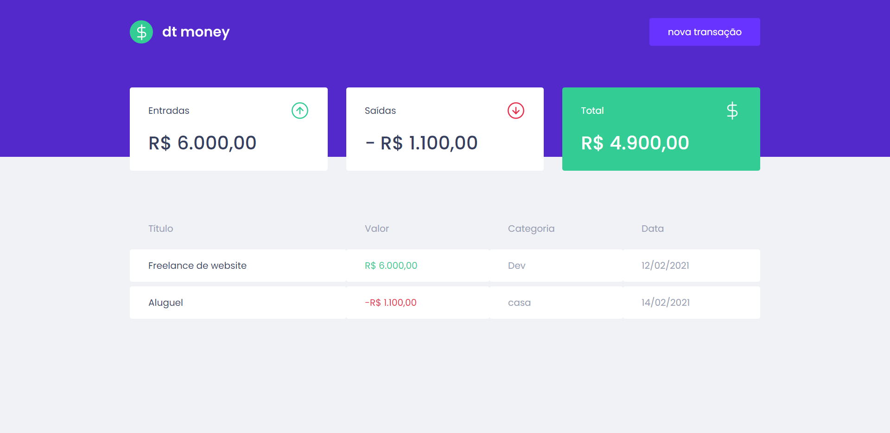

<p align="center">
  
</p>

<h1 align="center">
  DT Money V2
</h1>

<p align="center">Aplicação desenvolvida no Ignite Rocketseat</p>

<p align="center">
  <a href="#">
    
  </a>

  <a href="https://github.com/IgorThierry">
    
  </a>

  <a href="https://www.linkedin.com/in/igorthierry/">
    
  </a>
</p>

## 🚀 Projeto

Essa versão do projeto DT Money está integrada com uma API feita em Laravel, que pode ser encontrada [aqui](https://github.com/IgorThierry/dt-money-api-laravel).

## 🔧 Tecnologias

- [React](https://reactjs.org/)
- [TypeScript](https://www.typescriptlang.org/)
- [Styled Components](https://styled-components.com/)
- [Radix UI](https://github.com/radix-ui/primitives)
- [Phosphor Icons](https://github.com/phosphor-icons/react)
- [JSON Server](https://github.com/typicode/json-server)
- [Axios](https://github.com/axios/axios)
- [React Hook Form](https://github.com/react-hook-form/react-hook-form)
- [Zod](https://github.com/colinhacks/zod)

## 💻 Executando a aplicação

<span style="color:red">**Antes de executar esse app siga o passo a passo para subir o servidor da API [aqui](https://github.com/IgorThierry/dt-money-api-laravel).**</span>

Clone o repositório com:

```bash
git clone git@github.com:IgorThierry/ignite-react-dtmoney-v2.git
```

Acesse a pasta do projeto

```bash
cd ignite-react-dtmoney-v2
```

Em seguida instale as dependências com:

```bash
npm install
```

Adicione as variáveis de ambiente de acordo com o arquivo `.env.example` e renomeie para `.env`.

Preecha a variável `VITE_API_URL` com o endereço da API.

```bash
VITE_API_URL=http://localhost
```

Em seguida inicie a aplicação com:

```bash
npm run dev
```

---

Feito com ♥ by [Igor Thierry](https://www.linkedin.com/in/igorthierry/)
